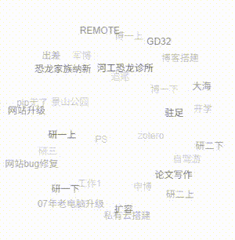

### 标签云特效插件 Svg3dTagCloud_V1.0.1



#### 使用方法

- 下载本插件，解压放到 usr/plugins/ 目录中
- 文件夹名改为 Svg3dTagCloud
- 登录管理后台，激活插件 配置插件
- 在展示标签的地方加上
-```html
- <div id="tag-cloud"></div>
```
#### 版本说明
我typecho版本是1.3.0，主题是splity，在使用Svg3dTagCloud原插件时发现两个问题，1.点击标签云中的标签跳转的网址有问题。2.除了主页面，其他页面都加载不出来标签云。所以顺手就在原作者的基础上迭代了一个版本。
针对问题1，修复了标签链接生成方式，现在兼容多种URL重写配置。
针对问题2，新增全局挂载点，使标签云在所有页面可见。

#### 插件说明
插件基于`jquery.svg3dtagcloud.js`
JS文档  https://github.com/NiklasKnaack/jquery-svg3dtagcloud-plugin

#### 联系版本作者
- Email: yuuki19970617@163.com
- 欢迎访问 www.yuukisoul.com 一起学习讨论

#### 联系初代作者
- Email:`i@hoehub.com`
- 欢迎访问 www.hoehub.com 一起学习讨论

### 许可证 License

- 本项目遵循GPL-3.0开源协议发布。
- 版本版权所有Copyright © 2025 by Yuuki (http://www.yuukisoul.com)
- 初代版权所有Copyright © 2018 by Hoe (http://www.hoehub.com)
- All rights reserved。
